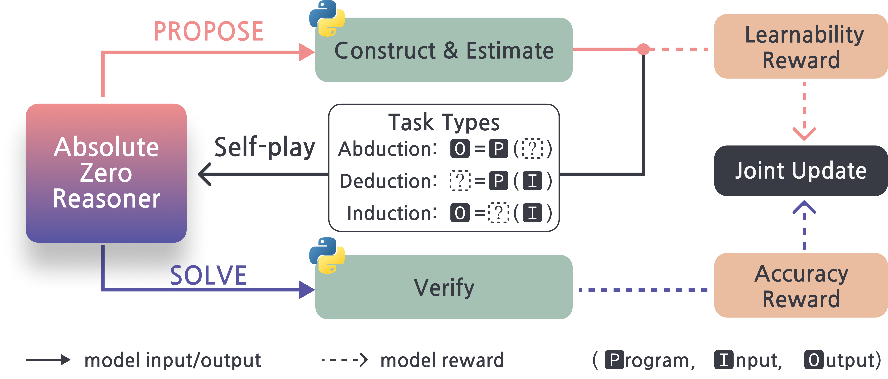

<div align="center">

# Absolute Zero: 데이터 없이 강화된 자기-플레이 추론

> ⚠️ **참고**: 이 저장소는 [Absolute Zero Reasoner](https://github.com/LeapLabTHU/Absolute-Zero-Reasoner) 프로젝트의 커스텀 구현체입니다. 원본 저장소는 링크된 URL에서 확인하실 수 있습니다.

[](https://arxiv.org/abs/2505.03335)    [](https://andrewzh112.github.io/absolute-zero-reasoner/)    [](https://github.com/LeapLabTHU/Absolute-Zero-Reasoner)    [](https://huggingface.co/collections/andrewzh/absolute-zero-reasoner-68139b2bca82afb00bc69e5b)    [](https://wandb.ai/andrewzhao112/AbsoluteZeroReasoner)

<div align="center" style="font-family: Arial, sans-serif;">
  <p>
    <a href="#news" style="text-decoration: none; font-weight: bold;">🎉 새소식</a> •
    <a href="#links" style="text-decoration: none; font-weight: bold;">🔗 링크</a> •
    <a href="#todo" style="text-decoration: none; font-weight: bold;">📝 로드맵</a> •
    <a href="#algorithm-flow" style="text-decoration: none; font-weight: bold;">⚙️ 알고리즘 흐름</a> •
    <a href="#results" style="text-decoration: none; font-weight: bold;">📊 결과</a>
  </p>
  <p>
    <a href="#getting-started" style="text-decoration: none; font-weight: bold;">✨ 시작하기</a> •
    <a href="#training" style="text-decoration: none; font-weight: bold;">🏋️ 훈련</a> •
    <a href="#usage" style="text-decoration: none; font-weight: bold;">🔧 사용법</a> •
    <a href="#evaluation-code" style="text-decoration: none; font-weight: bold;">📃 평가</a>
  </p>
  <p>
    <a href="#citation" style="text-decoration: none; font-weight: bold;">🎈 인용</a> •
    <a href="#acknowledgement" style="text-decoration: none; font-weight: bold;">🌻 감사</a> •
    <a href="#contact" style="text-decoration: none; font-weight: bold;">📧 연락처</a> •
    <a href="#star-history" style="text-decoration: none; font-weight: bold;">📈 스타 히스토리</a>
  </p>
</div>

</div>


<!-- ============================================== -->

- **[2025/05/06]** **Absolute Zero Reasoner**를 공개합니다. [[프로젝트 페이지](https://andrewzh112.github.io/absolute-zero-reasoner/) | [논문](https://arxiv.org/abs/2505.03335) | [코드](https://github.com/LeapLabTHU/Absolute-Zero-Reasoner) | [모델](https://huggingface.co/collections/andrewzh/absolute-zero-reasoner-68139b2bca82afb00bc69e5b) | [로그](https://wandb.ai/andrewzhao112/AbsoluteZeroReasoner)]

<!-- ============================================== -->
<div align="left">
  <h1 id="links">🔗 링크</h1>
  <hr style="height: 3px; background: linear-gradient(90deg, #EF8E8D, #5755A3); border: none; border-radius: 3px;">
</div>

- 🏠 [[프로젝트 페이지]](https://andrewzh112.github.io/absolute-zero-reasoner/)
- 📜 [[논문]](https://arxiv.org/abs/2505.03335)
- 🤗 [[모델]](https://huggingface.co/collections/andrewzh/absolute-zero-reasoner-68139b2bca82afb00bc69e5b)
- 💻 [[코드]](https://github.com/LeapLabTHU/Absolute-Zero-Reasoner)
- 📁 [[로그]](https://wandb.ai/andrewzhao112/AbsoluteZeroReasoner)

<!-- ============================================== -->
<div align="left">
  <h1 id="todo">📝 로드맵</h1>
  <hr style="height: 3px; background: linear-gradient(90deg, #EF8E8D, #5755A3); border: none; border-radius: 3px;">
</div>

<!-- Roadmap Item: Completed -->
<div style="margin-bottom: 0.8rem; padding: 0.8rem 1.2rem; background-color: rgba(87, 85, 163, 0.1); border-left: 5px solid #5755A3; border-radius: 8px; display: flex; align-items: center;">
  <span style="font-size: 1.2em; margin-right: 0.8rem; color: #5755A3;">✅</span>
  <span style="text-decoration: line-through; color: #AAA; font-size: 1.1em;">훈련 코드 공개</span>
</div>

<!-- Roadmap Item: Pending -->
<div style="margin-bottom: 0.8rem; padding: 0.8rem 1.2rem; background-color: rgba(239, 142, 141, 0.2); border-left: 5px solid #EF8E8D; border-radius: 8px; display: flex; align-items: center;">
  <span style="font-size: 1.2em; margin-right: 0.8rem; color: #EF8E8D;">⏳</span>
  <span style="color: #FFF; font-size: 1.1em; font-weight: 500;">평가 코드 공개</span>
</div>

<!-- Roadmap Item: Pending -->
<div style="margin-bottom: 0.8rem; padding: 0.8rem 1.2rem; background-color: rgba(239, 142, 141, 0.2); border-left: 5px solid #EF8E8D; border-radius: 8px; display: flex; align-items: center;">
  <span style="font-size: 1.2em; margin-right: 0.8rem; color: #EF8E8D;">⏳</span>
  <span style="color: #FFF; font-size: 1.1em; font-weight: 500;">veRL 업데이트</span>
</div>

<!-- Roadmap Item: Pending -->
<div style="margin-bottom: 0.8rem; padding: 0.8rem 1.2rem; background-color: rgba(239, 142, 141, 0.2); border-left: 5px solid #EF8E8D; border-radius: 8px; display: flex; align-items: center;">
  <span style="font-size: 1.2em; margin-right: 0.8rem; color: #EF8E8D;">⏳</span>
  <span style="color: #FFF; font-size: 1.1em; font-weight: 500;">Python 실행기 업그레이드</span>
</div>

<!-- ============================================== -->
<div align="left">
  <h1 id="algorithm-flow">⚙️ 알고리즘 흐름</h1>
  <hr style="height: 3px; background: linear-gradient(90deg, #EF8E8D, #5755A3); border: none; border-radius: 3px;">
</div>

우리의 접근법은 다음 두 단계를 반복적으로 수행하는 과정에 중점을 둡니다:

1. <span style="color:#EF8E8D"><b>생성(PROPOSE)</b></span>: 모델이 귀납, 연역, 유추 유형의 추론 과제를 생성합니다. 과제는 Python 실행을 통해 검증되며 학습 가능성 보상을 받습니다.

2. <span style="color:#5755A3"><b>해결(SOLVE)</b></span>: 모델이 스스로 생성한 과제를 해결하려 시도합니다. 솔루션은 Python 실행을 통해 검증되며 정확도 보상을 받습니다.

모델은 두 단계를 TRR++로 반복하며, 외부 훈련 데이터 없이 자기 진화 루프를 통해 추론 능력을 강화합니다.



<!-- ============================================== -->
<div align="left">
  <h1 id="results">📊 결과</h1>
  <hr style="height: 3px; background: linear-gradient(90deg, #EF8E8D, #5755A3); border: none; border-radius: 3px;">
</div>

## 주요 결과

우리의 접근법은 외부 데이터 없이도 코드 및 수학 추론 벤치마크에서 강력한 성능을 달성합니다:

<table>
  <thead>
    <tr>
      <th align="center">모델</th>
      <th align="center">베이스</th>
      <th align="center">#데이터</th>
      <th align="center">코드 평균</th>
      <th align="center">수학 평균</th>
      <th align="center">전체 평균</th>
    </tr>
  </thead>
  <tbody>
    <!-- Base Models Section -->
    <tr>
      <td colspan="6" align="center"><b>베이스 모델</b></td>
    </tr>
    <tr>
      <td>Qwen2.5-7B</td>
      <td>-</td>
      <td>-</td>
      <td>52.0</td>
      <td>27.5</td>
      <td>39.8</td>
    </tr>
    <tr>
      <td>Qwen2.5-7B-Ins</td>
      <td>-</td>
      <td>-</td>
      <td>56.3</td>
      <td>37.0</td>
      <td>46.7</td>
    </tr>
    <tr>
      <td>Qwen2.5-7B-Coder</td>
      <td>-</td>
      <td>-</td>
      <td>56.6</td>
      <td>23.9</td>
      <td>40.2</td>
    </tr>
    <!-- Zero-Style Reasoners with Code Data -->
    <tr>
      <td colspan="6" align="center"><b>코드 데이터로 학습된 Reasoner</b></td>
    </tr>
    <tr>
      <td>AceCoder-RM</td>
      <td>Ins</td>
      <td>22k</td>
      <td>58.3</td>
      <td>37.4</td>
      <td>47.9</td>
    </tr>
    <tr>
      <td>AceCoder-RM</td>
      <td>Coder</td>
      <td>22k</td>
      <td>57.3</td>
      <td>27.5</td>
      <td>42.4</td>
    </tr>
    <tr>
      <td>AceCoder-Rule</td>
      <td>Ins</td>
      <td>22k</td>
      <td>55.4</td>
      <td>36.9</td>
      <td>46.2</td>
    </tr>
    <tr>
      <td>AceCoder-Rule</td>
      <td>Coder</td>
      <td>22k</td>
      <td>60.0</td>
      <td>28.5</td>
      <td>44.3</td>
    </tr>
    <tr>
      <td>CodeR1-LC2k</td>
      <td>Ins</td>
      <td>2k</td>
      <td>60.5</td>
      <td>35.6</td>
      <td>48.0</td>
    </tr>
    <tr>
      <td>CodeR1-12k</td>
      <td>Ins</td>
      <td>10k</td>
      <td>61.3</td>
      <td>33.5</td>
      <td>47.4</td>
    </tr>
    <!-- Zero-Style Reasoners with Math Data -->
    <tr>
      <td colspan="6" align="center"><b>수학 데이터로 학습된 Reasoner</b></td>
    </tr>
    <tr>
      <td>PRIME-Zero</td>
      <td>Coder</td>
      <td>484k</td>
      <td>37.2</td>
      <td><b>45.8</b></td>
      <td>41.5</td>
    </tr>
    <tr>
      <td>SimpleRL-Zoo</td>
      <td>Base</td>
      <td>8.5k</td>
      <td>54.0</td>
      <td>38.5</td>
      <td>46.3</td>
    </tr>
    <tr>
      <td>Oat-Zero</td>
      <td>Math</td>
      <td>8.5k</td>
      <td>45.4</td>
      <td>44.3</td>
      <td>44.9</td>
    </tr>
    <tr>
      <td>ORZ</td>
      <td>Base</td>
      <td>57k</td>
      <td>55.6</td>
      <td>41.6</td>
      <td>48.6</td>
    </tr>
    <!-- Our Approach -->
    <tr style="background-color: rgba(239, 142, 141, 0.1);">
      <td colspan="6" align="center"><b>Absolute Zero 훈련 (외부 데이터 없음, 본 연구)</b></td>
    </tr>
    <tr style="background-color: rgba(239, 142, 141, 0.1);">
      <td>AZR (본 연구)</td>
      <td>Base</td>
      <td><b>0</b></td>
      <td>55.2 <span style="color:#00AA00">+3.2</span></td>
      <td>38.4 <span style="color:#00AA00">+10.9</span></td>
      <td>46.8 <span style="color:#00AA00">+7.0</span></td>
    </tr>
    <tr style="background-color: rgba(87, 85, 163, 0.1);">
      <td>AZR (본 연구)</td>
      <td>Coder</td>
      <td><b>0</b></td>
      <td><b>61.6</b> <span style="color:#00AA00">+5.0</span></td>
      <td>39.1 <span style="color:#00AA00">+15.2</span></td>
      <td><b>50.4</b> <span style="color:#00AA00">+10.2</span></td>
    </tr>
  </tbody>
</table>

## 스케일링 결과

AZR은 모델 크기와 종류에 관계없이 일관된 성능 향상을 보입니다:

<table>
  <thead>
    <tr>
      <th align="center">모델 계열</th>
      <th align="center">변형</th>
      <th align="center">코드 평균</th>
      <th align="center">수학 평균</th>
      <th align="center">전체 평균</th>
    </tr>
  </thead>
  <tbody>
    <tr>
      <td>Llama3.1-8b</td>
      <td></td>
      <td>28.5</td>
      <td>3.4</td>
      <td>16.0</td>
    </tr>
    <tr style="background-color: rgba(87, 85, 163, 0.1);">
      <td>Llama3.1-8b</td>
      <td>+ AZR (Ours)</td>
      <td>31.6 <span style="color:#00AA00">+3.1</span></td>
      <td>6.8 <span style="color:#00AA00">+3.4</span></td>
      <td>19.2 <span style="color:#00AA00">+3.2</span></td>
    </tr>
    <tr>
      <td>Qwen2.5-3B Coder</td>
      <td></td>
      <td>51.2</td>
      <td>18.8</td>
      <td>35.0</td>
    </tr>
    <tr style="background-color: rgba(87, 85, 163, 0.1);">
      <td>Qwen2.5-3B Coder</td>
      <td>+ AZR (Ours)</td>
      <td>54.9 <span style="color:#00AA00">+3.7</span></td>
      <td>26.5 <span style="color:#00AA00">+7.7</span></td>
      <td>40.7 <span style="color:#00AA00">+5.7</span></td>
    </tr>
    <tr>
      <td>Qwen2.5-7B Coder</td>
      <td></td>
      <td>56.6</td>
      <td>23.9</td>
      <td>40.2</td>
    </tr>
    <tr style="background-color: rgba(87, 85, 163, 0.1);">
      <td>Qwen2.5-7B Coder</td>
      <td>+ AZR (Ours)</td>
      <td>61.6 <span style="color:#00AA00">+5.0</span></td>
      <td>39.1 <span style="color:#00AA00">+15.2</span></td>
      <td>50.4 <span style="color:#00AA00">+10.2</span></td>
    </tr>
    <tr>
      <td>Qwen2.5-14B Coder</td>
      <td></td>
      <td>60.0</td>
      <td>20.2</td>
      <td>40.1</td>
    </tr>
    <tr style="background-color: rgba(87, 85, 163, 0.1);">
      <td>Qwen2.5-14B Coder</td>
      <td>+ AZR (Ours)</td>
      <td>63.6 <span style="color:#00AA00">+3.6</span></td>
      <td>43.0 <span style="color:#00AA00">+22.8</span></td>
      <td>53.3 <span style="color:#00AA00">+13.2</span></td>
    </tr>
  </tbody>
</table>

<!-- ============================================== -->
<div align="left">
  <h1 id="getting-started">✨ 시작하기</h1>
  <hr style="height: 3px; background: linear-gradient(90deg, #EF8E8D, #5755A3); border: none; border-radius: 3px;">
</div>

## 🎄 환경 설정
```bash
conda create -n azr python=3.10
conda activate azr
conda install nvidia/label/cuda-12.4.1::cuda-toolkit
cd verl
pip install -e .
cd ..
pip install wheel
pip install flash-attn --no-build-isolation
pip install -r requirements.txt
pip uninstall vllm
pip install vllm==0.7.3
pip install transformers==4.47.1
pip install "math-verify[antlr4_9_3]"
pip install debugpy
```

## 💾 데이터 처리
### AZR 자기-플레이 중 CruxEval / LiveCodeBench 실행 평가 데이터 처리
```bash
python -m absolute_zero_reasoner.data_construction.process_code_reasoning_data
```

<!-- ============================================== -->
<div align="left">
  <h1 id="training">🏋️ 훈련</h1>
  <hr style="height: 3px; background: linear-gradient(90deg, #EF8E8D, #5755A3); border: none; border-radius: 3px;">
</div>

> **⚠️경고⚠️**: 이 저장소의 Python 실행기는 연구 목적으로만 제공되며, 매우 원시적인 상태입니다. 프로덕션 환경에서는 안전하지 않습니다. 향후 더 안전한 구현으로 업데이트할 예정입니다. 본 코드를 사용하는 것은 전적으로 사용자의 책임입니다.

## 🫛 시드 데이터 생성(선택)
data/ 폴더에 각 모델로 프롬프트하여 수집한 시드 데이터셋을 제공합니다. 직접 시드 데이터를 만들고 싶다면 아래 스크립트를 사용하세요:
```bash
export OUTPUT_SEED_PATH=data/<새_ded_abd_시드_데이터_이름>.jsonl
export OUTPUT_CODE_F_SEED_PATH=data/<새_ind_시드_데이터_이름>.jsonl
bash scripts/seeding/<7b|14b|coder3b|coder7b|coder14b|llama>.sh
```

## ♟️ 자기-플레이
3b 모델은 80GB GPU 2개, 7/8b 모델은 4개, 14b는 8개 필요합니다.
```bash
bash scripts/selfplay/<7b|14b|coder3b|coder7b|coder14b|llama>.sh
```
직접 만든 ded/abd 또는 ind 시드 데이터셋을 사용하려면:
```bash
export OUTPUT_SEED_PATH=data/<your_ded_abd_seed_data_name>.jsonl
export OUTPUT_CODE_F_SEED_PATH=data/<your_ind_seed_data_name>.jsonl
bash scripts/selfplay/<7b|14b|coder3b|coder7b|coder14b|llama>.sh
```

## 🌚 중단된 실험 이어서 실행하기
실험을 이어서 실행할 때는 원래의 wandb run id를 스크립트에 넣으세요. 예: `trainer.wandb_run_id=<run_id>`

## 🤗 veRL 체크포인트를 HF 포맷으로 변환
```bash
python -m absolute_zero_reasoner.utils.convert2hf \
  <veRL_ckpt_path>/actor \
  <veRL_ckpt_path>/actor/huggingface/ \
  <hf_ckpt_path>
```

## 📈나만의 내재적 보상(Intrinsic Rewards) 설계하기!
configs에서 `azr.reward.generation_reward_config`에 원하는 보상을 추가하세요. diversity, complexity 등 이미 구현된 예시를 참고할 수 있습니다. 창의적으로 만들어보세요!

<!-- ============================================== -->
<div align="left">
  <h1 id="usage">🔧 사용법</h1>
  <hr style="height: 3px; background: linear-gradient(90deg, #EF8E8D, #5755A3); border: none; border-radius: 3px;">
</div>

Deepseek R1의 <think> & <answer> 태그를 프롬프트 템플릿으로 사용합니다:

```
User와 Assistant의 대화. 사용자가 질문을 하면 Assistant가 해결합니다. Assistant는 먼저 마음속으로 추론 과정을 생각한 뒤, 사용자에게 답을 제공합니다. 추론 과정과 답변은 각각 <think> </think>와 <answer> </answer> 태그로 감쌉니다. 예시: <think> 추론 과정 </think> <answer> 답변 </answer>. User: {question}\nAssistant: <think>
```

<!-- ============================================== -->
<div align="left">
  <h1 id="evaluation-code">📃 평가 코드</h1>
  <hr style="height: 3px; background: linear-gradient(90deg, #EF8E8D, #5755A3); border: none; border-radius: 3px;">
</div>

TODO

<!-- ============================================== -->
<div align="left">
  <h1 id="citation">🎈 인용</h1>
  <hr style="height: 3px; background: linear-gradient(90deg, #EF8E8D, #5755A3); border: none; border-radius: 3px;">
</div>

Absolute Zero Reasoner가 도움이 되었다면 아래와 같이 인용해 주세요.

```bibtex
@misc{zhao2025absolutezeroreinforcedselfplay,
      title={Absolute Zero: Reinforced Self-play Reasoning with Zero Data}, 
      author={Andrew Zhao and Yiran Wu and Yang Yue and Tong Wu and Quentin Xu and Yang Yue and Matthieu Lin and Shenzhi Wang and Qingyun Wu and Zilong Zheng and Gao Huang},
      year={2025},
      eprint={2505.03335},
      archivePrefix={arXiv},
      primaryClass={cs.LG},
      url={https://arxiv.org/abs/2505.03335}, 
}
```

<!-- ============================================== -->
<div align="left">
  <h1 id="acknowledgement">🌻 감사</h1>
  <hr style="height: 3px; background: linear-gradient(90deg, #EF8E8D, #5755A3); border: none; border-radius: 3px;">
</div>

본 강화학습 훈련 코드베이스는 [veRL framework](https://github.com/volcengine/verl)를 포크하여 제작되었습니다. 롤아웃에는 [vLLM](https://github.com/vllm-project/vllm)을 사용했습니다. Python 실행기 컴포넌트는 [QwQ Repository](https://github.com/QwenLM/QwQ/tree/main/eval/eval/math_opensource_utils)에서 가져왔습니다. 또한 README 구조는 [PRIME](https://github.com/PRIME-RL/PRIME)에서 참고하였습니다.
이 프로젝트들의 훌륭한 기여에 감사드립니다!

<!-- ============================================== -->
<div align="left">
  <h1 id="contact">📧 연락처</h1>
  <hr style="height: 3px; background: linear-gradient(90deg, #EF8E8D, #5755A3); border: none; border-radius: 3px;">
</div>

문의사항은 Andrew Zhao (zqc21@mails.tsinghua.edu.cn)에게 이메일로 연락해 주세요.

<!-- ============================================== -->
<div align="left">
  <h1 id="star-history">📈 스타 히스토리</h1>
  <hr style="height: 3px; background: linear-gradient(90deg, #EF8E8D, #5755A3); border: none; border-radius: 3px;">
</div>

[](https://www.star-history.com/#LeapLabTHU/Absolute-Zero-Reasoner&Date)
